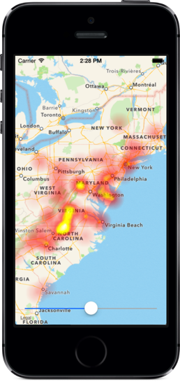

# LFHeatMap

iOS heat map package



## Features
* extremely fast heat map generation from point/weight data pairs
* generates UIImage objects that can be overlaid as needed
* variable boost/bleed

## Anti-Features
LFHeatMap is a simple `UIImage` generator. The resulting object can be used like any other `UIImage`, standalone or in a `UIImageView`. While it can be overlaid on top of a `MKMapView`, it is not strongly tied to this specific component and hence does not offer the benefits that come with a more complex implementation of `MKOverlayRenderer`.

## Adding LFHeatMap to your project

### CocoaPods

[CocoaPods](http://cocoapods.org) is a dependency manager for Objective-C, which automates and simplifies the process of using 3rd-party libraries like LFHeatMap in your projects. See the ["Getting Started"](https://github.com/gpolak/LFHeatMap/wiki/Installing-LFHeatMap-via-CocoaPods) guide for more information.

```ruby
platform :ios, '5.0'
pod "LFHeatMap"
```

### Source files

Alternatively you can directly add the `LFHeatMap` folder to your project.

## Demo
This demo plots the measured magnitudes of the [2011 Virginia Earthquake](http://en.wikipedia.org/wiki/2011_Virginia_earthquake).

### Running
1. Open and launch the LFHeatMapDemo XCode project. 
2. Move the slider on the bottom to adjust the boost.

### Explanation

The data is stored in `quake.plist` which is a simple plist storing the latitude, longitude, and magnitude of each measurement. The points (locations) and weights (magnitudes) are stored in two `NSArray` objects in `viewDidLoad` of `LFHeadMapDemoViewController`.

The main action takes place in the `sliderChanged:` function. Moving the slider determines the new boost value and generates a new heat map image. The image's dimensions are the same as the `self.mapView` object, with the points and weights supplied by the two data arrays. The image is then passed to the overlaying `UIImageView` that sits on top of the map.


## LFHeatMap

This class contains the three basic static functions used to generate the heat maps.

### 1. Basic Heat Map

Supply the desired image dimensions and boost, as well as the point/value arrays. There should be a 1:1 mapping between these two arrays, that is each index in the *points* array should have a corresponding index in the *weights* array.

```objective-c
@params
rect: region frame
boost: heat boost value
points: array of NSValue CGPoint objects representing the data points
weights: array of NSNumber integer objects representing the weight of each point
 
@returns
UIImage object representing the heatmap for the specified region.
 
+ (UIImage *)heatMapWithRect:boost:points:weights:
```

### 2. Advanced Heat Map

Works generally the same as the basic heat map, but allows to tweak two additional parameters to control the "bleed" of heat rendering.

```objective-c
@params
rect: region frame
boost: heat boost value
points: array of NSValue CGPoint objects representing the data points
weights: array of NSNumber integer objects representing the weight of each point
weightsAdjustmentEnabled: set YES for weight balancing and normalization
groupingEnabled: set YES for tighter visual grouping of dense areas
 
@returns
UIImage object representing the heat map for the specified region.
 
+ (UIImage *)heatMapWithRect:boost:points:weights:weightsAdjustmentEnabled:groupingEnabled:
```

### 3. MKMapView Helper

Works the same as the basic heat map, but allows you to supply map-specific parameters. Pass an `MKMapView` object (typically the target you want to overlay), and an array of `CLLocation` objects corresponding to coordinates on the specified `MKMapView` object.

The function will convert these to the required CGRect/CGPoint values as needed.

```objective-c
@params 
mapView: Map view representing the heat map area.
boost: heat boost value
locations: array of CLLocation objects representing the data points
weights: array of NSNumber integer objects representing the weight of each point
 
@returns
UIImage object representing the heatmap for the map region.

+ (UIImage *)heatMapForMapView:boost:locations:weights:
```

## LF?

LFHeatMap comes from my work on the (now shut down) LocalFaves framework from [Skyhook Wireless](http://skyhookwireless.com). This component has been open-sourced and formed the basis of a chapter in the [Geolocation in iOS](http://www.amazon.com/Geolocation-iOS-Mobile-Positioning-Mapping/dp/1449308449/ref=sr_1_18?ie=UTF8&qid=undefined&sr=8-18&keywords=corelocation) book.
